# Reverse Engineering the MOZA I2C Communication

## Table of Contents
- [Overview](#overview)
- [Code Structure](#code-structure)
  - [Arduino Implementation (`code/`)](#arduino-implementation-code)
  - [Raspberry Pi 4 C++ Implementation (`code_rpi/`)](#raspberry-pi-4-c-implementation-code_rpi)
- [I2C Communication Details](#i2c-communication-details)
  - [Initialization & Setup](#initialization--setup)
  - [Communication States and Payloads](#communication-states-and-payloads)
  - [Device Identification](#device-identification)
- [Input Handling ](#input-handling)
  - [Regular Buttons](#regular-buttons)
  - [Paddles](#paddles)
  - [Rotary Encoders](#rotary-encoders)
- [Reverse Engineering Process](#reverse-engineering-process)
  - [Tools Used](#tools-used)
  - [Communication Analysis](#communication-analysis)
- [End Result](#assembled-and-working-wheel-example)

## Overview

- **Context:**  
  This work targets the **MOZA ES / GS Wheels**, which are recognized by various MOZA Racing Wheel Bases through specific I2C payloads. We will discuss the various payloads and what they mean based on context that is known. A lot of what is done here is based on assumptions that were done during testing. These details are not known to be completely accurate as the testing was only done on a single wheelbase and only the ES wheel. The solution is also used in a very custom context as a personal project so although the findings here are useful to anyone, the specific application would need to be modified.
  
- **Firmware Versions:**  
  The protocol is known to work on firmware versions:
  - **Firmware XXX** – TO BE ADDED
  
- **I2C Communication:**  
  The wheel acts as an I2C slave, and based on commands received from the master (the wheel base), it responds with data reflecting the state of various inputs.

- **Input Handling:**  
  - **Regular Buttons:** Update payloads when pressed/released.
  - **Paddles:** Use predefined payloads to indicate paddle states.
  
- **Development Environment:**  
  - **Arduino / AVR:** Developed using PlatformIO on VSCode (Arduino Micro / UNO).
  - **Raspberry Pi 4 Model B:** C++ implementation using `pigpio` Broadcom Serial Controller (BSC) I2C Slave interface (`code_rpi/`).

## Code Structure

### Arduino Implementation (`code/`)

- **I2C Communication:**
  - **`i2c_handler.cpp`:**  
    Implements the I2C event handlers (`requestEvent` and `receiveEvent`).

- **Input Handlers:**
  - **`button_handler.cpp`**, **`encoder_handler.cpp`**, **`paddle_handler.cpp`**, **`keypad_handler.cpp`**.

### Raspberry Pi 4 C++ Implementation (`code_rpi/`)

A standalone C++ implementation located in `code_rpi/` designed to run directly on a **Raspberry Pi 4 Model B**.

- **Hardware Pinout:**
  - **GPIO 10 = SDA → Physical Pin 19**
  - **GPIO 11 = SCL → Physical Pin 23**
  - **GND → Physical Pin 20** (or any Pi ground)

- **Key Components:**
  - **`moza_wheel_state.hpp / .cpp`:** Thread-safe state container supporting configurable wheel identification (`MOZA_GS` = `0x08`, `MOZA_ES` = `0x04`, `MOZA_FSR` = `0x0C`), programmatic button & paddle setters (`setButton`, `setLeftPaddle`, `setRightPaddle`), and display/LED telemetry callbacks.
  - **`i2c_handler.hpp / .cpp`:** Configures pigpio BSC hardware slave mode on GPIO 10 & 11 (address `0x09`) and processes read/write sequences from the wheelbase.
  - **`main.cpp` & `Makefile`:** Build and startup entry point.

To compile and run on Raspberry Pi:
```bash
cd code_rpi
make
sudo ./moza_rpi_slave
```

## I2C Communication Details

### Initialization & Setup

- **Slave Address:**  
  The slave address is defined as `0x09` in `i2c_handler.cpp`. This is the known address that is requested by the wheel base at all times:
  ```cpp
  #define SLAVE_ADDRESS 0x09
  ```

- **Slave Setup:**  
  In `main.cpp`, the Arduino is configured as an I2C slave:
  ```cpp
  Wire.begin(SLAVE_ADDRESS);
  Wire.setClock(400000);
  ```

  400000 is the standard I2C clock speed. This is the speed that the wheel base communicates with the Arduino. Although analyzing the wheelbase was done at a slower speed. Refer to more detailed protocol information in the [Reverse Engineering Process](#reverse-engineering-process) section.

- **Event Handlers:**
  - **`requestEvent()`:**  
    Sends a payload based on the active state:
    - **FC_RECEIVED:** Returns `FC_PAYLOAD` to indicate a wheel is connected. (`0x04` for ES Wheel, `0x08` for GS Wheel, `0x0C` for FSR Wheel).
    - **F9_RECEIVED:** Returns `F9_PAYLOAD`.
    - **DD_RECEIVED:** Returns a combination of button and rotary encoder payloads.
    - **DE_RECEIVED:** Returns the paddle payload.
  - **`receiveEvent()`:**  
    Reads command bytes from the I2C master. Depending on the command (e.g., `0xFC`), it updates the current state and adjusts the payload index for subsequent responses.

### Communication States and Payloads

| **Command Byte** | **Description**                                                  |
|------------------|------------------------------------------------------------------|
| 0xFC             | Device identification: Indicates the connected MOZA Wheel.       |
| 0xF9             | Not sure but not sending this byte after FC causes missing inputs|
| 0xDD             | All buttons payloads. 5 responses in a sequence                  |
| 0xDE             | Paddle payload. Different from regular button input              |

### Device Identification

The `0xFC` command is used to identify the connected device. When the MOZA Wheel is detected, the wheel base requests an `FC_PAYLOAD` to confirm the connection:
- `0x04`: MOZA ES Wheel
- `0x08`: MOZA GS Wheel
- `0x0C`: MOZA FSR Wheel

## Input Handling

### Regular Buttons

Regular buttons are managed in `button_handler.cpp` using mappings defined in `button_mapping.h`. Each button press or release adjusts the corresponding index in the `btnPayloads` array. This is the response to the `0xDD` command. This is updated all the time where no button input is `0x00`. In MOZA's pithouse software, the button inputs are updated in a sequence of responses to five 0xDD commands.

So the response when registering inputs is `DD -> DD -> DD -> DD -> DD` where each DD responds to a corresponding payload index as defined below.

Note: Pithouse button numbers are not sequential - this reflects how they appear in the software. That is how they are displayed in pithouse. The PCB of the ES wheel displays the switches differently and the payloads and values make more sense there but in this context it is easier to understand.

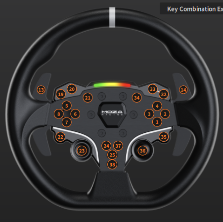

#### Button Mapping Table

| **Pithouse**   | **Payload Index** | **Value** |
|----------------|-------------------|-----------|
| 1              | 1                 | 0x40      |
| 2              | 1                 | 0x80      |
| 3              | 1                 | 0x20      |
| 4              | 0                 | 0x80      |
| 5              | 4                 | 0x80      |
| 6              | 3                 | 0x10      |
| 7              | 3                 | 0x08      |
| 8              | 4                 | 0x40      |
| 19             | 4                 | 0x10      |
| 20             | 4                 | 0x20      |
| 21             | 4                 | 0x08      |
| 22             | 3                 | 0x40      |
| 23             | 3                 | 0x80      |
| 24             | 3                 | 0x20      |
| 25             | 2                 | 0x40      |
| 32             | 0                 | 0x40      |
| 33             | 0                 | 0x10      |
| 34             | 0                 | 0x20      |
| 35             | 1                 | 0x10      |
| 36             | 2                 | 0x80      |
| 37             | 2                 | 0x10      |
| 38             | 2                 | 0x20      |

We also see multiple buttons inputs being registered at the same time. Simply put, the values of the specific indices are added together. So if we added all the buttons for index 0 the max value would be `0xF0` for payload at index 0.

### Paddles

Paddle inputs are processed in `paddle_handler.cpp` and implemented in `paddle.cpp`. Each paddle uses a predefined payload that, when added or removed, updates the `paddlePayloads` array. The paddles are not processed the same way as the buttons. Maybe some sort of priority to them but even in pithouse the buttons are displayed differently. 

#### Paddle Mapping Table

| **Pithouse**      | **Payload**                                 | **Description**   |
|-------------------|---------------------------------------------|-------------------|
| 13                | {0xC2, 0xC2, 0xC0, 0xC0, 0xC2}              | Left Paddle       |
| 14                | {0xC4, 0xC4, 0xC0, 0xC0, 0xC4}              | Right Paddle      |

### Rotary Encoders

The rotary encoders are handled using regular button inputs using some encoding algorithms found on YouTube. There are MOZA wheels with actual encoders but the ES wheel does not have them so we do not know how they work. Won't go into detail here but the encoder_handler.cpp file has the code for the encoder. Handled as payloads the same way as buttons but reset right after sending it. 

NOTE: Known issue is spinning the encoder too fast causes the encoder to add two inputs at the same time. Although during an actual race this has not been an issue.

### Led Handling & Display Telemetry

LEDs and shift lights are sent on address **`0x08`**. Displays / telemetry packets are sent on address **`0x20`**.

## Reverse Engineering Process

### Tools Used

- **Logic Analyzer:**  
  Used to capture I2C communication between the wheel base and the Arduino. The cheap ones for 15 bucks on Amazon did the trick.
    
- **Sigrok Pulseview:**  
  Used to analyze the I2C communication. Had issues with Saleae Logic software so this was the alternative.

- **Pithouse Software:**  
  Used to observe the button inputs.


### Example Data

The data folder contains some example data captured from the logic analyzer. Some showing the wheel connected and some showing the wheel disconnected, along with example button inputs. The button inputs were attempted to be captured between 600ms and 1400ms and held continuously between those times. If you want to look for the input looking around the 1000ms will guarantee you see the input.

To view the data:
- Download and install [Sigrok Pulseview](https://sigrok.org/wiki/Downloads)
- Open the software and load a `.sr` file from the data folder
- Press the "add protocol decoder" button

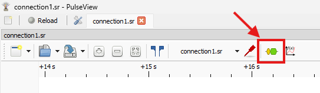

- Then type "i2c" in the search bar. Double click in I2C.

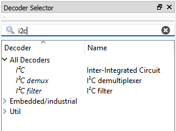

- Press the green "I2C" button at the bottom of the channels on the left and set SCL to D0 and SDA to D1.

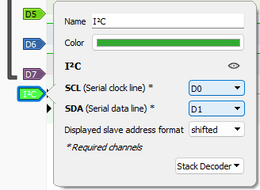

### Establishing a Connection

Using some harware to create the intermediate connection is needed. So creating some type of y splitter between the wheel and the base makes life easier. The communcation is caught using jumper cables to connect the logic analyzer to the split wires.

### Communication Analysis

- **Slave NACK:**  
  When nothing is connected to the wheelbase we see a sequence of `0x09` being sent to request the device. This polling is done at about every 3.5 seconds. That is why we see a delay when connecting the wheel to the base in pithouse.

  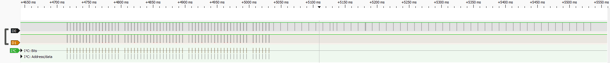
  
  Zooming into the analyzer we see the address that we are looking to acknowledge which is `0x09`. This is specifically the sequence of requests for the device ID. We will see more of this.

  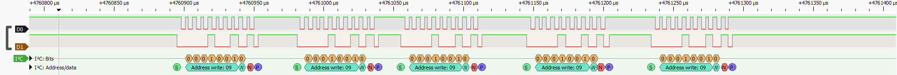

- **Slave ACK:**  
  When the wheel is connected we see the `0x09` being acknowledged by the wheel. This is the first step in the communication process. The wheel base is now ready to send commands to the wheel. After various tests, there is no real pattern to what is acknowledged first and it does not seem to matter. We can also see a distinct change in the communication.

  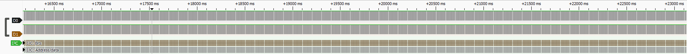

  To keep this consistent we are looking for a specific sequence of requests and in this case we have 5 address writes for `0x09`. This again refers to the device ID. Now we see the acknowledgement and know that the wheel base is connected with the response `0xFC`. 

  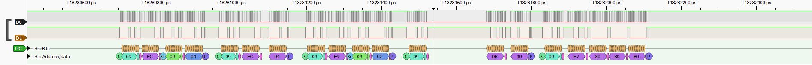

- **Button Capture:**
    The button inputs are captured in a sequence of 5 responses to the `0xDD` command. This is the sequence of button inputs that are sent to the wheel base. The first response is the first 5 buttons, the second response is the next 5 buttons and so on. This is repeated in a loop. 
    
    Below we can look at an example of one of the button inputs. 

    The red box indicated what is being read for that response. In this case `DR: 00` means there is no button input. The green box is hard to understand from the context that is known but `DW: 08` is an indicator of which index of payloads is being polled.
    
    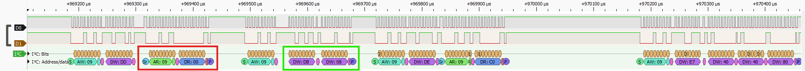

    Here we can see the next index that is polled which in the green box shows `DW: 04` and the data read is `DR: 40`. And if referred to in the [Button Mapping Table](#button-mapping-table) this corresponds to button 1 being pressed or as the table suggests index 1 and payload 0x40.  

    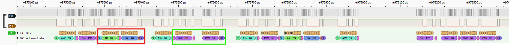

    TO BE ADDED: Paddle Capture, slightly more complex scenario but can also be determined from the code

## Assembled and Working Wheel Example

This was done one a very custom basis and the code is not optimized to be used in any scenario. This was specifically adapted to work with the Turn Racing R8 LMS wheel. [Turn Racing Github](https://github.com/turnracing/turnracing-diy/wiki) 

Although the final result is custom this can be adapted to work in any project and encouraged to be used, as well as possibly expanded to emulate not only the ES wheel but other wheels as well.

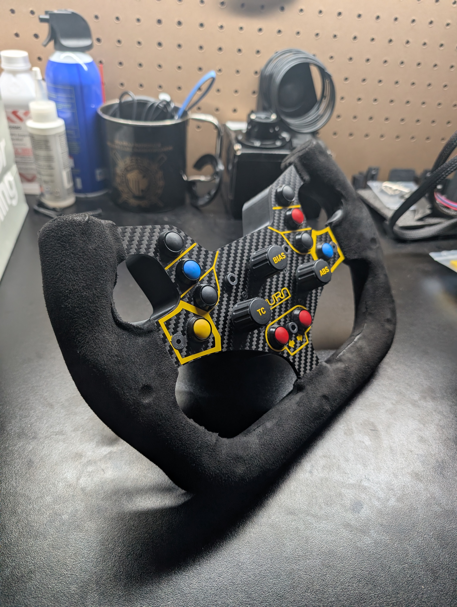
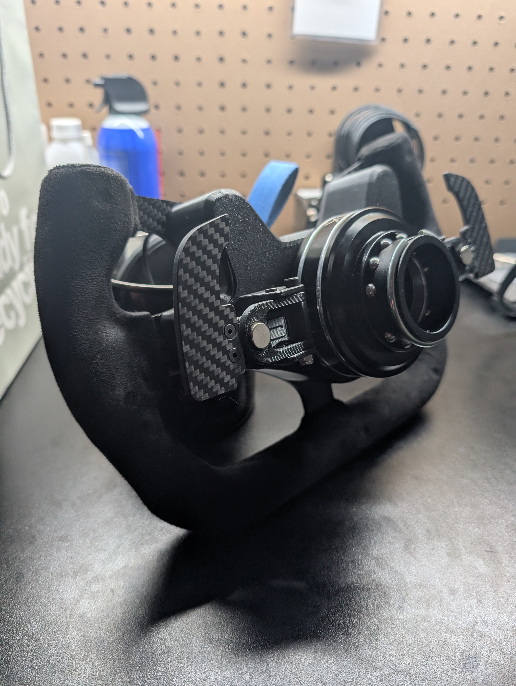
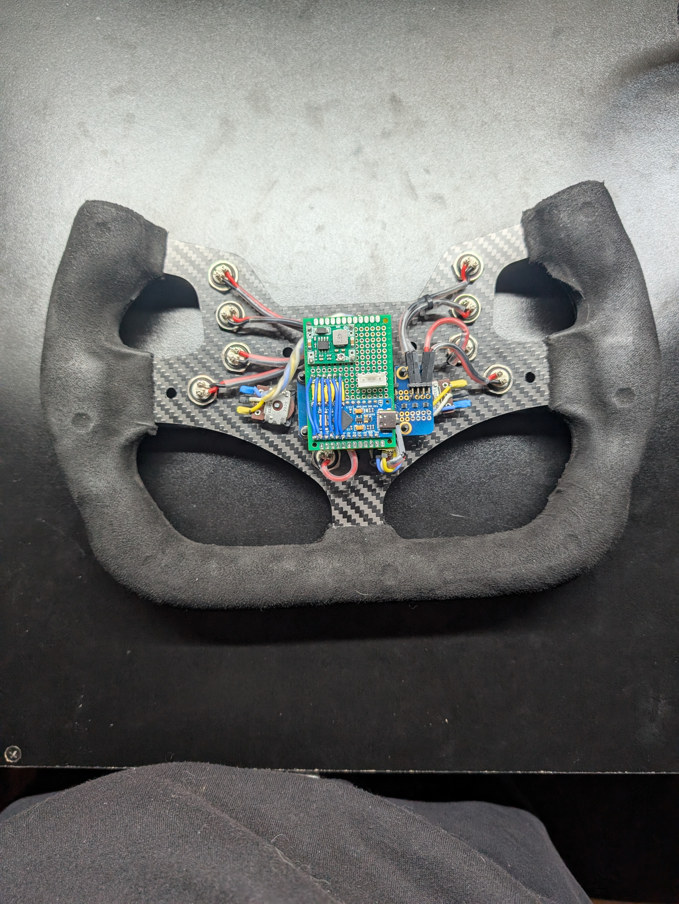
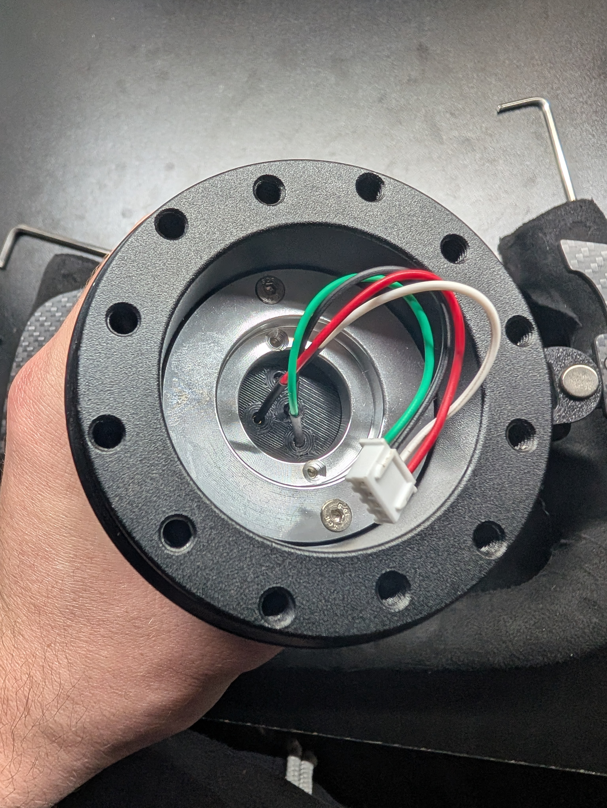
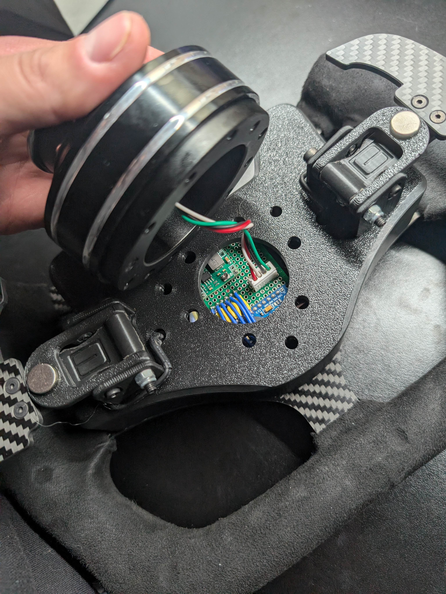
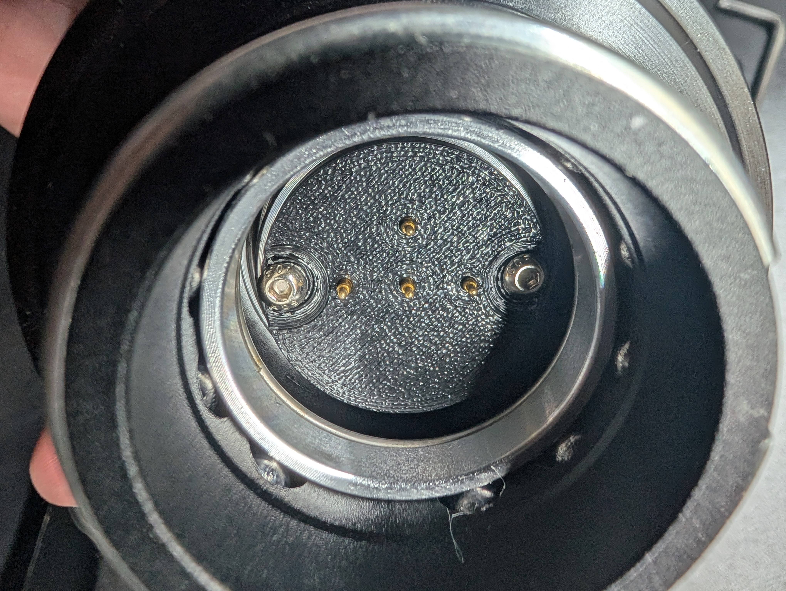
